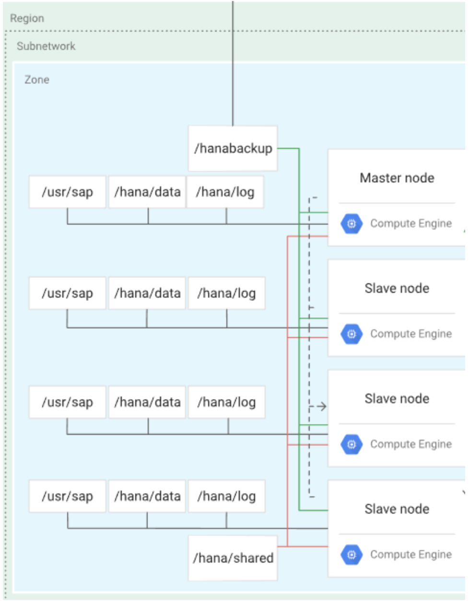

# HANA-Scaleout

This stack builds a HANA Scaleout instance with multiple workers.

# Architecture Diagram



# Prerequisites

## Infrastructure

If not using the provided Terraform, the following infrastructure components must exist.

### HANA

One HANA master machine is required.

One or more HANA worker machines are required.

#### HANA Master Disks

Two disks must be created and attached to the machine.

`data` - This disk will contain three logical volumes, `data`, `log`, and `usr` (for `/usr/sap`).  Attach the disk to the machine with a [`device_name`](https://registry.terraform.io/providers/hashicorp/google/latest/docs/resources/compute_attached_disk#device_name) of `data` to use the value Ansible uses for it by default, otherwise it requires redefining the variable `sap_hana_disks`. See the [GCP SAP HANA planning guide](https://cloud.google.com/solutions/sap/docs/sap-hana-planning-guide#hana-minimum-pd-sizes-ssd-balanced) for disk sizing.

`backup` - The backup disk will have a single logical volume. Attach the disk to the machine with a `device_name` of `backup` to use the value Ansible uses for it by default. See the [GCP SAP HANA planning guide](https://cloud.google.com/solutions/sap/docs/sap-hana-planning-guide#hana-minimum-pd-sizes-ssd-balanced) for disk sizing.

#### HANA Worker Disks

One disk must be created and attached to each machine.

`data` - This disk will contain four logical volumes, `data`, `shared`, `log`, and `usr` (for `/usr/sap`).  Attach the disk to the machine with a [`device_name`](https://registry.terraform.io/providers/hashicorp/google/latest/docs/resources/compute_attached_disk#device_name) of `data` to use the value Ansible uses for it by default, otherwise it requires redefining the variable `sap_hana_disks`. See the [GCP SAP HANA planning guide](https://cloud.google.com/solutions/sap/docs/sap-hana-planning-guide#hana-minimum-pd-sizes-ssd-balanced) for disk sizing.

## Inventory

If using Terraform and Ansible together, the inventory is automatically generated. If using Ansible separately from or without Terraform, the inventory must be defined as shown.

### Inventory groups

The following inventory groups must be defined containing the hosts described below. You can choose your own names for the groups.

* HANA group
  * Contains master and worker groups

* HANA master group
  * 1 host

* HANA worker group
  * 1 or more worker hosts

### Examples

INI format:

```ini
# Note: when using INI formatted inventory, boolean inventory values
# must be in uppercase or Ansible will convert them to strings.

[hana:children]
hana_master
hana_worker

[hana_master]
abchana sap_hana_is_master=True

[hana_worker]
abchanaw01 sap_hana_is_worker=True
abchanaw02 sap_hana_is_worker=True
```

YAML format:

```yaml
all:
  children:
    hana:
      children:
        hana_master:
        hana_worker:
    hana_master:
      hosts:
        abchana:
          sap_hana_is_master: true
    hana_worker:
      hosts:
        abchanaw01:
          sap_hana_is_worker: true
        abchanaw02:
          sap_hana_is_worker: true
```

## Install Media

See [the instructions](../install-media.md) for uploading install media to your bucket.

# Variables

## Variables related to Terraform

The following variables are only used when Terraform and Ansible are run together.

| Name | Description | Type | Default | Required |
|------|-------------|------|---------|:--------:|
| `sap_hana_instance_type` | The GCE instance type for HANA. Must be one of `n1-highmem-32`, `n1-highmem-64`, `n1-highmem-96`, `n2-highmem-32`, `n2-highmem-48`, `n2-highmem-64`, `n2-highmem-80`, `m1-megamem-96`, `m1-ultramem-40`, `m1-ultramem-80`, `m1-ultramem-160`, `m2-ultramem-208`, or `m2-ultramem-416`. | `string` | `n1-highmem-32` | no |
| `sap_hana_service_account_name` | The name of the service account assigned to HANA instances. This should not be a full service account email, just the name before the `@` symbol. | `string` | `sap-common-sa` | no |
| `sap_project_id` | The project ID where instances are located. | `string` | n/a | yes |
| `sap_zone` | The zone for sap HANA and Netweaver instances, for example `us-central1-a`. | `string` | `us-central1-a` | no |
| `sap_hana_subnetwork` | The name of the hana subnetwork | `string` | n/a | yes |
| `sap_subnetwork_project_id` | The name of the subnetwork project, if using a shared VPC. If not given, `sap_project_id` will be used. | `string` | value of `sap_project_id` | no |
| `sap_source_image_family` | The source image family for machines. | `string` | n/a | yes |
| `sap_source_image_project` | The project for the source image. Official SAP images are from `rhel-sap-cloud` for RedHat or `suse-sap-cloud` for Suse. | `string` | n/a | yes |
| `sap_hana_autodelete_boot_disk` | Delete hana boot disks along with instance deletion | `boolean` | true | no |
| `sap_hana_boot_disk_size` |  Hana boot disk size | `integer` | 30 | no |
| `sap_hana_boot_disk_type` |  Hana boot disk type | `string` | `pd-ssd` | no |
| `sap_hana_additional_disk_type` |  Hana additional disk type | `string` | `pd-ssd` | no |
| `sap_hana_network_tags` |  Hana instance network tags to add to instance for traffic routing | `list` | ["sap-hana-allow-all"] | no |
| `sap_hana_pd_kms_key` |  Hana persistent disk KMS key | `string` | None | no |
| `sap_instance_count_worker` |  Hana worker instance count to deploy | `integer` | 1 | no |
| `sap_hana_create_backup_volume` |  Create backup volume for hana instance | `boolean` | true | no |
| `sap_tf_state_bucket` | The GCS bucket where Terraform state is stored. If it does not exist, it will be created. There can only be one bucket globally with a given name (it gets a global DNS name). If there is a permissions error when creating this bucket, it is likely that one already exists in another project with the same name. Note that the pair `sap_tf_state_bucket`, `sap_tf_state_bucket_prefix` must be unique to avoid conflicts with other stacks. | `string` | n/a | yes |
| `sap_tf_state_bucket_prefix` | This is the prefix for the Terraform state within the bucket defined in `sap_tf_state_bucket`. Note that the pair `sap_tf_state_bucket`, `sap_tf_state_bucket_prefix` must be unique to avoid conflicts with other stacks. | `string` | n/a | yes |

## Additional Variables

The following variables are used with and without Terraform.

| Name | Description | Type | Default | Required |
|------|-------------|------|---------|:--------:|
| `sap_hana_instance_name` | The name of the HANA instance. | `string` | n/a | yes |
| `sap_hana_instance_number` | Instance number for HANA. This is a two digit number that must be in quotes, or Ansible will convert it into single digits, for example `00` without surrounding quotes gets converted to the number `0`. | `string` | `00` | no |
| `sap_hana_install_files_bucket` | Bucket where HANA installation files are located. | `string` | n/a | yes |
| `sap_hana_password` | The password for HANA. | `string` | n/a | yes |
| `sap_hana_product_version` | The version of HANA. | `string` | `20SPS03` | no |
| `sap_hana_sid` | The System ID for HANA. This is a three character uppercase string which may include digits but must start with a letter. | `string` | n/a | yes |
| `sap_hana_backup_size` | The size of the `backup` volume's filesystem in [LVM format](https://docs.ansible.com/ansible/latest/collections/community/general/lvol_module.html#parameter-size). See the [GCP SAP HANA planning guide](https://cloud.google.com/solutions/sap/docs/sap-hana-planning-guide#persistent_disk_size_requirements_for_scale-out_systems) for partition sizing. | `string` | n/a | yes, if terraform is not used |
| `sap_hana_data_size` | The size of the `data` volume's filesystem in [LVM format](https://docs.ansible.com/ansible/latest/collections/community/general/lvol_module.html#parameter-size). See the [GCP SAP HANA planning guide](https://cloud.google.com/solutions/sap/docs/sap-hana-planning-guide#persistent_disk_size_requirements_for_scale-out_systems) for partition sizing. | `string` | n/a | yes, if terraform is not used |
| `sap_hana_log_size` | The size of the `log` volume's filesystem in [LVM format](https://docs.ansible.com/ansible/latest/collections/community/general/lvol_module.html#parameter-size). See the [GCP SAP HANA planning guide](https://cloud.google.com/solutions/sap/docs/sap-hana-planning-guide#persistent_disk_size_requirements_for_scale-out_systems) for partition sizing. | `string` | n/a | yes, if terraform is not used |
| `sap_hana_shared_size` | The size of the `shared` volume's filesystem in [LVM format](https://docs.ansible.com/ansible/latest/collections/community/general/lvol_module.html#parameter-size). See the [GCP SAP HANA planning guide](https://cloud.google.com/solutions/sap/docs/sap-hana-planning-guide#persistent_disk_size_requirements_for_scale-out_systems) for partition sizing. | `string` | n/a | yes, if terraform is not used |
| `sap_hana_usr_size` | The size of the `/usr/sap` volume's filesystem in [LVM format](https://docs.ansible.com/ansible/latest/collections/community/general/lvol_module.html#parameter-size). See the [GCP SAP HANA planning guide](https://cloud.google.com/solutions/sap/docs/sap-hana-planning-guide#persistent_disk_size_requirements_for_scale-out_systems) for partition sizing. | `string` | n/a | yes, if terraform is not used |
| `sap_hana_virtual_host` | The hostname used by the application to connect to HANA. | `string` | n/a | yes |
