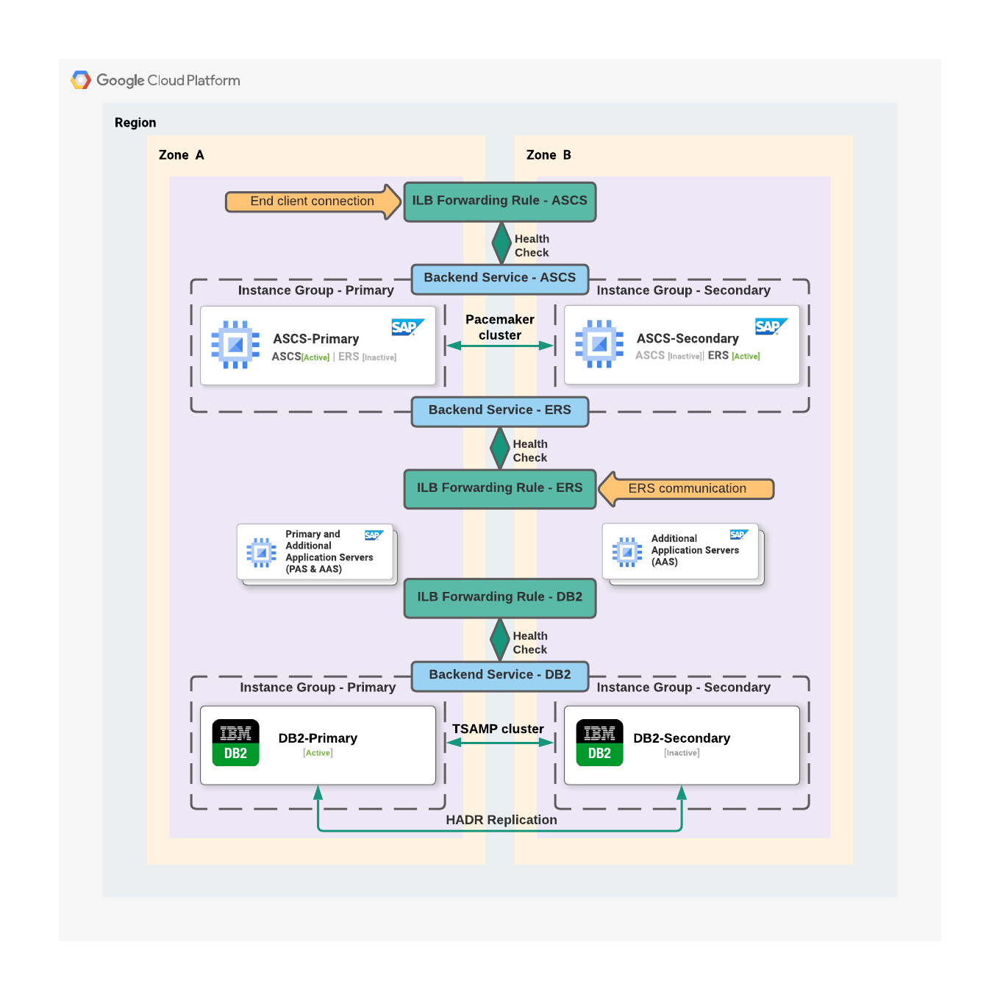

# NetWeaver-DB2-HA

This stack builds SAP application instances with DB2 in HA mode.

# Architecture Diagram



# Prerequisites

## Infrastructure

If not using the provided Terraform, the following infrastructure components must exist.

### DB2

Two DB2 machines are required, one for the primary and one for the secondary.

#### Disks

Three disks must be created and attached to each DB2 machine.

`db2` - This disk will contain one logical volume to be mounted on `/db2`.  Attach the disk to the machine with a [`device_name`](https://registry.terraform.io/providers/hashicorp/google/latest/docs/resources/compute_attached_disk#device_name) of `db2` to use the value Ansible uses for it by default.

`usrsap` - This disk will contain one logical volume to be mounted on `/usr/sap`.  Attach the disk to the machine with a [`device_name`](https://registry.terraform.io/providers/hashicorp/google/latest/docs/resources/compute_attached_disk#device_name) of `usrsap` to use the value Ansible uses for it by default.

`swap` - This disk will contain one logical volume to be used for swap.  Attach the disk to the machine with a [`device_name`](https://registry.terraform.io/providers/hashicorp/google/latest/docs/resources/compute_attached_disk#device_name) of `swap` to use the value Ansible uses for it by default.

### SCS

One ASCS machine is required.

One ERS machine is required.

#### Disks

Two disks must be created and attached to each SCS machine.

`usrsap` - This disk will contain one logical volume to be mounted on `/usr/sap`.  Attach the disk to the machine with a [`device_name`](https://registry.terraform.io/providers/hashicorp/google/latest/docs/resources/compute_attached_disk#device_name) of `usrsap` to use the value Ansible uses for it by default.

`swap` - This disk will contain one logical volume to be used for swap.  Attach the disk to the machine with a [`device_name`](https://registry.terraform.io/providers/hashicorp/google/latest/docs/resources/compute_attached_disk#device_name) of `swap` to use the value Ansible uses for it by default.

### Application servers

One PAS machine is required.

Zero or more AAS machines are required.

#### Disks

Two disks must be created and attached to each application server machine.

`usrsap` - This disk will contain one logical volume to be mounted on `/usr/sap`.  Attach the disk to the machine with a [`device_name`](https://registry.terraform.io/providers/hashicorp/google/latest/docs/resources/compute_attached_disk#device_name) of `usrsap` to use the value Ansible uses for it by default.

`swap` - This disk will contain one logical volume to be used for swap.  Attach the disk to the machine with a [`device_name`](https://registry.terraform.io/providers/hashicorp/google/latest/docs/resources/compute_attached_disk#device_name) of `swap` to use the value Ansible uses for it by default.

## Inventory

If using Terraform and Ansible together, the inventory is automatically generated. If using Ansible separately from or without Terraform, the inventory must be defined as shown.

### Inventory groups

The following inventory groups must be defined containing the hosts described below. You can choose your own names for the groups.

* SAP group
  * 1 primary DB2 host
  * 1 secondary DB2 host
  * 1 ASCS host
  * 1 ERS host
  * 1 PAS host
  * 0 or more AAS hosts

### SAP application inventory host variables

| Name | Description | Type | Default | Required |
|------|-------------|------|---------|:--------:|
| `sap_is_ascs` | Whether or not this is the ASCS host. | `bool` | n/a | yes, on the ASCS host |
| `sap_is_ers` | Whether or not this is the ERS host. | `bool` | n/a | yes, on the ERS host |
| `sap_is_scs` | Whether or not this is an ASCS or ERS host. | `bool` | n/a | yes, on the ASCS and ERS hosts |
| `sap_is_db2` | Whether or not this is a DB2 host. | `bool` | n/a | yes, on both DB2 hosts |
| `sap_is_db2_primary` | Whether or not this is the DB2 primary host. | `bool` | n/a | yes, on the DB2 primary host |
| `sap_is_db2_secondary` | Whether or not this is the DB2 primary host. | `bool` | n/a | yes, on the DB2 secondary host |
| `sap_is_pas` | Whether or not this is the PAS host. | `bool` | n/a | yes, on the PAS host |
| `sap_is_aas` | Whether or not this is an AAS host. | `bool` | n/a | yes, on AAS hosts |

### Examples

INI format:

```ini
# Note: when using INI formatted inventory, boolean inventory values
# must be in uppercase or Ansible will convert them to strings.

[sap]
abcdb2p sap_is_db2=True sap_is_db2_primary=True
abcdb2s sap_is_db2=True sap_is_db2_secondary=True
abcascs sap_is_scs=True sap_is_ascs=True
abcers sap_is_scs=True sap_is_ers=True
abcpas sap_is_pas=True
abcaas1 sap_is_aas=True
abcaas2 sap_is_aas=True
```

YAML format:

```yaml
all:
  children:
    sap:
      hosts:
        abcdb2p:
          sap_is_db2: true
          sap_is_db2_primary: true
        abcdb2s:
          sap_is_db2: true
          sap_is_db2_secondary: true
        abcascs:
          sap_is_scs: true
          sap_is_ascs: true
        abcers:
          sap_is_scs: true
          sap_is_ers: true
        abcpas:
          sap_is_pas: true
        abcaas1:
          sap_is_aas: true
        abcaas2:
          sap_is_aas: true
```

## Install Media

See [the instructions](../install-media.md) for uploading install media to your bucket.

# Variables

## Variables related to Terraform

The following variables are only used when Terraform and Ansible are run together.

| Name | Description | Type | Default | Required |
|------|-------------|------|---------|:--------:|
| `sap_db2_instance_name_primary` | Name of primary DB2 server instance. | `string` | n/a | yes |
| `sap_db2_instance_name_secondary` | Name of primary DB2 server instance. | `string` | n/a | yes |
| `sap_db2_instance_type` | The GCE instance type for the DB2 instances. | `string` | `e2-standard-8`| no |
| `sap_filestore_name` | The name of the Cloud Filestore used for NFS mounts. If not provided, no Filestore instance will be created. | `string` | `''`| no |
| `sap_nw_ascs_instance_name` | Name of the ASCS instance. | `string` | n/a | yes |
| `sap_nw_as_instance_basename` | Base name of application server instances. A number will be appended to determine the final name. The first will be the PAS instance, and subsequent ones will be AAS. | `string` | n/a | yes |
| `sap_nw_instance_type` | The GCE instance type for SAP application instances. | `string` | `e2-standard-8`| no |
| `sap_nw_service_account_name` | The name of the service account assigned to application and DB2 instances. This should not be a full service account email, just the name before the `@` symbol. | `string` | `sap-common-sa` | no |
| `sap_nw_subnetwork` | The name of the subnetwork used for the ASCS and PAS machines. | `string` | n/a | yes |
| `sap_primary_zone` | The zone for primary instances, DB2 primary, ASCS, PAS, and AAS alternating even instances, for example `us-central1-a`. | `string` | n/a | yes |
| `sap_secondary_zone` | The zone for secondary instances, DB2 secondary, ERS, and AAS alternating odd instances, for example `us-central1-b`. | `string` | n/a | yes |
| `sap_project_id` | The project ID where instances are located. | `string` | n/a | yes |
| `sap_subnetwork_project_id` | The name of the subnetwork project, if using a shared VPC. If not given, `sap_project_id` will be used. | `string` | value of `sap_project_id` | no |
| `sap_source_image_family` | The source image family for machines. | `string` | n/a | yes |
| `sap_source_image_project` | The project for the source image. Official SAP images are from `rhel-sap-cloud` for RedHat or `suse-sap-cloud` for Suse. | `string` | n/a | yes |
| `sap_tf_state_bucket` | The GCS bucket where Terraform state is stored. If it does not exist, it will be created. There can only be one bucket globally with a given name (it gets a global DNS name). If there is a permissions error when creating this bucket, it is likely that one already exists in another project with the same name. Note that the pair `sap_tf_state_bucket`, `sap_tf_state_bucket_prefix` must be unique to avoid conflicts with other stacks. | `string` | n/a | yes |
| `sap_tf_state_bucket_prefix` | This is the prefix for the Terraform state within the bucket defined in `sap_tf_state_bucket`. Note that the pair `sap_tf_state_bucket`, `sap_tf_state_bucket_prefix` must be unique to avoid conflicts with other stacks. | `string` | n/a | yes |

## Additional Variables

The following variables are used with and without Terraform.

| Name | Description | Type | Default | Required |
|------|-------------|------|---------|:--------:|
| `sap_db2_product_version` | The DB2 product version. | `string` | `11.5MP5FP1` | no |
| `sap_db2_virtual_host` | The hostname given to the DB2 load balancer, added to `/etc/hosts` of instances. | `string` | n/a | yes |
| `sap_db2_vip` | The IP address of the DB2 load balancer, added to `/etc/hosts` of instances. | `string` | n/a | yes |
| `sap_nw_ascs_instance_number` | Instance number for ASCS. This is a two digit number that must be in quotes, or Ansible will convert it into single digits, for example `00` without surrounding quotes gets converted to the number `0`. | `string` | `00` | no |
| `sap_nw_ascs_install_gateway` | Whether or not to install the gateway on the ASCS node. | `bool` | `false` | no |
| `sap_nw_ascs_install_web_dispatcher` | Whether or not to install the web dispatcher on the ASCS node. | `bool` | `false` | no |
| `sap_nw_ascs_virtual_host` | The hostname given to the ASCS load balancer, added to `/etc/hosts` of instances. | `string` | n/a | yes |
| `sap_nw_ascs_vip` | The IP address of the ASCS load balancer, added to `/etc/hosts` of instances. | `string` | n/a | yes |
| `sap_nw_ers_instance_number` | Instance number for ERS. This is a two digit number that must be in quotes, or Ansible will convert it into single digits, for example `00` without surrounding quotes gets converted to the number `0`. | `string` | `10` | no |
| `sap_nw_ers_virtual_host` | The hostname given to the ERS load balancer, added to `/etc/hosts` of instances. | `string` | n/a | yes |
| `sap_nw_ers_vip` | The IP address of the ERS load balancer, added to `/etc/hosts` of instances. | `string` | n/a | yes |
| `sap_nw_install_files_bucket` | Bucket where SAP and DB2 install media is located. | `string` | n/a | yes |
| `sap_nw_nfs_src` | The NFS share, for example `10.0.0.100:/sap`. | `string` | see [NFS Volumes](#nfs-volumes) | yes, if other NFS variables are not defined |
| `sap_nw_create_nfs_source_dirs` | Whether or not to create subdirectories on `sap_nw_nfs_src` to be used as separate mounts. | `bool` | `true` if `sap_nw_nfs_src` is defined | no |
| `sap_nw_nfsvols_aas` | NFS volumes to be mounted on AAS. | `list` of `dict` | see [NFS Volumes](#nfs-volumes) | yes, if `sap_nw_nfs_src` is not defined |
| `sap_nw_nfsvols_db2` | NFS volumes to be mounted on DB2. | `list` of `dict` | see [NFS Volumes](#nfs-volumes) | yes, if `sap_nw_nfs_src` is not defined |
| `sap_nw_nfsvols_pas` | NFS volumes to be mounted on PAS. | `list` of `dict` | see [NFS Volumes](#nfs-volumes) | yes, if `sap_nw_nfs_src` is not defined |
| `sap_nw_nfsvols_scs` | NFS volumes to be mounted on ASCS and ERS. | `list` of `dict` | see [NFS Volumes](#nfs-volumes) | yes, if `sap_nw_nfs_src` is not defined |
| `sap_nw_password` | The password for NetWeaver. | `string` | n/a | yes |
| `sap_nw_pas_instance_number` | Instance number for PAS. This is a two digit number that must be in quotes, or Ansible will convert it into single digits, for example `00` without surrounding quotes gets converted to the number `0`. | `string` | `00` | no |
| `sap_nw_sid` | The System ID for NetWeaver. This is a three character uppercase string which may include digits but must start with a letter. | `string` | n/a | yes |
| `sap_nw_product` | The SAP product. | `string` | `NetWeaver` | no |
| `sap_nw_product_version` | The SAP product version, defaults to a version for NetWeaver. | `string` | `750` | no |

## NFS Volumes

The variables `sap_nw_nfsvols_aas`, `sap_nw_nfsvols_db2`, `sap_nw_nfsvols_pas`, and `sap_nw_nfsvols_scs` are all lists of dictionaries. They have defaults which are defined if `sap_nw_nfs_src` is set, but for more control they can be set individually. If Terraform is used and `sap_filestore_name` is defined, `sap_nw_nfs_src` will be automatically derived from it.

Each dictionary must be defined as follows:

| Name | Description | Type | Default | Required |
|------|-------------|------|---------|:--------:|
| `source` | The NFS server and share, for example `10.2.3.4:/sap`. | `string` | n/a | yes |
| `mountpoint` | The mount point. | `string` | n/a | yes |
| `mode` | The mode of the mount point. | `string` | `0755` | no |
| `owner` | The owner of the mount point. If the user will be created by the SAP installer, use the UID rather than the name, as the SAP installer will not have created the user before mounting the filesystem. | `string` | `root` | no |
| `group` | The group of the mount point. If the group will be created by the SAP installer, use the GID rather than the name, as the SAP installer will not have created the group before mounting the filesystem. | `string` | `root` | no |

Example:

```yaml
sap_nw_nfsvols_aas:
- source: 10.2.3.4:/sapmnt
  mountpoint: /sapmnt
- source: 10.6.7.8:/usrsaptrans
  mountpoint: /usr/sap/trans
  owner: '2001'
  group: '2000'
  mode: '0750'
```
