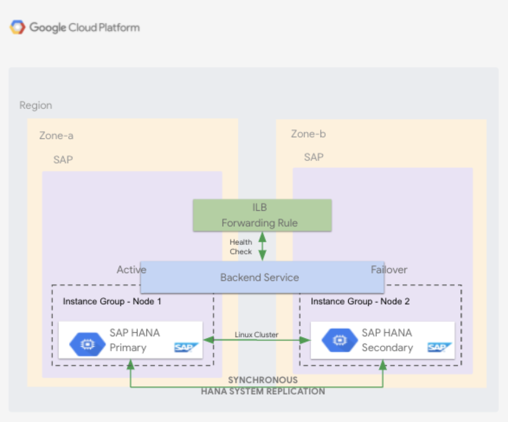

# SAP HANA installation and configuration using Terraform and Ansible

Terraform module and ansible roles to deploy the SAP HANA Scaleout stack. This stack deploys a master HANA node along with the required no.of worker nodes to form a HANA Scaleout cluster. All instances are deployed in the same zone. There is option to add additional worker nodes after the initial deployment. HANA Scaleout config is performed by a higher ansible role `ansible/roles/sap-hana-scaleout` that in turn calls lower ansible roles to do a specific task as part of the scaleout config.

# Deployment Architecture

### 

# Requirements

* Terraform version `>=0.12`
* Ansible version `>= 2.9.2`

# Usage

1. Terraform code for deploying the infrastructure required for installing and configuring SAP HANA Scaleout nodes is stored under `tf/`.

2. Ansible roles for configuring HANA Scaleout on the GCE instances is stored in the repository under `ansible/roles`.

3. Ansible playbook to deploy the HANA scaleout stack is `playbook.yml`.

# Variables

* All the ansible SAP HANA Scaleout configuration default values are defined in the higher level ansible role under `ansible/roles/sap-hana-scaleout/defaults/main.yml`.

* All the variables required for deploying stack are defined in the `vars/deploy-vars.yml` file.

`sap_zone` (required): GCP zone to deploy the sap instances 

`sap_project_id` (required): GCP project-id to deploy the resources

`sap_source_image_family` (required): GCE instances image family

`sap_source_image_project` (required): GCE instances image family project

`sap_subnetwork_project_id` (required): GCP project-id hosting the subnetwork. When using `shared_vpc` provide the host project-id of the subnetwork.

`sap_hana_subnetwork` (required): GCP subnetwork name

`sap_tf_state_bucket` (required): Terraform state bucket name storing the tf state file

`sap_tf_state_bucket_prefix` (required): Terraform state bucket prefix for storing tf state file

`sap_instance_count_worker`: No.of worker nodes to be deployed

`sap_hana_instance_name` (required): GCE instance name

`sap_hana_service_account_name` (required): GCP service account name

`sap_hana_instance_type`: GCE instance type (choose from the below)
```hcl
n1-highmem-32
n1-highmem-64
n1-highmem-96
n2-highmem-32
n2-highmem-48
n2-highmem-64
n2-highmem-80
m1-megamem-96
m1-ultramem-40
m1-ultramem-80
m1-ultramem-160
m2-ultramem-208
m2-ultramem-416
```
`sap_hana_autodelete_boot_disk`: Delete boot disk along with the instance

`sap_hana_boot_disk_size`: GCE instance boto disk size

`sap_hana_boot_disk_type`: pd-ssd

`sap_hana_network_tags`: List of network tags to add to the instances

`sap_hana_pd_kms_key`: Customer managed encryption key to use in persistent disks 

`sap_hana_create_backup_volume`: Provision HANA DB backup disk and attach to instance

`sap_hana_backint_install`: Install SAP HANA backint on the HANA nodes

`sap_hana_password`: Common password to use for all HANA user and system authentication

`sap_hana_preinstall_tasks`: Path to an Ansible task file that will run before HANA is installed. This can be an absolute path, or a relative path which is relative to the playbook directory.

`sap_hana_postinstall_tasks`: Path to an Ansible task file that will run after HANA is installed. This can be an absolute path, or a relative path which is relative to the playbook directory.

# Example playbook to deploy SAP HANA Scaleout stack

Below is the example playbook to deploy the HANA Scaleout stack. Replace the variable values to fit your need

```yaml
- name: SAP HANA deploy
  hosts: 127.0.0.1
  connection: local
  roles:
  - role: forminator
    vars:
      sap_tf_project_path: ./tf
      sap_state: "present"
      sap_hana_backint_install: true
      sap_hana_backint_bucket_name: "sap-hana-backint-backup"
      sap_tf_variables:
        instance_name: hanaslbg
        project_id: gcp-project-id
        source_image_family: source-image-family
        source_image_project: source-image-project
        subnetwork: subnetwork-name
        service_account_email: "sap-common-sa"
        subnetwork_project: '{{ sap_project_id }}'
        zone: "us-central1-a"
        instance_type: "n1-highmem-32"
        autodelete_disk: true
        boot_disk_size: 30
        boot_disk_type: "pd-ssd"
        network_tags: ["sap-allow-all"]
        pd_kms_key: None
        create_backup_volume: true
        instance_count_worker: 1

- name: SAP HANA scaleout master configure
  hosts: hana-master
  become: yes
  vars:
    sap_hana_backint_install: true
    sap_hana_backint_bucket_name: "sap-hana-backint-backup"
    sap_hana_master_instance_name: '{{ terraform.outputs.master_instance_name.value }}'
    sap_hana_master_instance_ip: '{{ terraform.outputs.address_master.value }}'
    sap_hana_worker_instance_ip: '{{ terraform.outputs.address_worker.value }}'
    sap_hana_worker_node_names: '{{ terraform.outputs.instances_self_links_worker.value }}'
    sap_hana_shared_size: '{{ terraform.outputs.hana_shared_size.value }}G'
    sap_hana_data_size: '{{ terraform.outputs.hana_data_size.value }}G'
    sap_hana_log_size: '{{ terraform.outputs.hana_log_size.value }}G'
    sap_hana_usr_size: '{{ terraform.outputs.hana_usr_size.value }}G'
    sap_hana_backup_size: '{{ terraform.outputs.hana_backup_size.value - 1 }}G'
  roles:
  - role: sap-hana-scaleout

- name: SAP HANA scaleout worker configure
  hosts: hana-worker
  become: yes
  vars:
    sap_hana_backint_install: true
    sap_hana_backint_bucket_name: "sap-hana-backint-backup"
    sap_hana_master_instance_name: '{{ terraform.outputs.master_instance_name.value }}'
    sap_hana_master_instance_ip: '{{ terraform.outputs.address_master.value }}'
    sap_hana_worker_instance_ip: '{{ terraform.outputs.address_worker.value }}'
    sap_hana_worker_node_names: '{{ terraform.outputs.instances_self_links_worker.value }}'
    sap_hana_shared_size: '{{ terraform.outputs.hana_shared_size.value }}G'
    sap_hana_data_size: '{{ terraform.outputs.hana_data_size.value }}G'
    sap_hana_log_size: '{{ terraform.outputs.hana_log_size.value }}G'
    sap_hana_usr_size: '{{ terraform.outputs.hana_usr_size.value }}G'
    sap_hana_backup_size: '{{ terraform.outputs.hana_backup_size.value - 1 }}G'
  roles:
  - role: sap-hana-scaleout

- name: SAP HANA scaleout master configure
  hosts: hana-master
  become: yes
  vars:
    sap_hana_backint_install: true
    sap_hana_backint_bucket_name: "sap-hana-backint-backup"
    sap_hana_master_instance_name: '{{ terraform.outputs.master_instance_name.value }}'
    sap_hana_master_instance_ip: '{{ terraform.outputs.address_master.value }}'
    sap_hana_worker_instance_ip: '{{ terraform.outputs.address_worker.value }}'
    sap_hana_worker_node_names: '{{ terraform.outputs.instances_self_links_worker.value }}'
    sap_hana_shared_size: '{{ terraform.outputs.hana_shared_size.value }}G'
    sap_hana_data_size: '{{ terraform.outputs.hana_data_size.value }}G'
    sap_hana_log_size: '{{ terraform.outputs.hana_log_size.value }}G'
    sap_hana_usr_size: '{{ terraform.outputs.hana_usr_size.value }}G'
    sap_hana_backup_size: '{{ terraform.outputs.hana_backup_size.value - 1 }}G'
    sap_add_worker_nodes: true
  roles:
  - role: sap-hana-scaleout
```

# Deploy HANA Scaleout stack

* Use the `ansible-wrapper` script at the root of the repository to deploy the stack. The ansible wrapper script will setup the environment along with installing the correct ansible version and dependencies required for running the code.

`./ansible-wrapper ./stacks/HANA-Scaleout/playbook.yml --extra-vars '@./stacks/HANA-Scaleout/vars/deploy-vars.yml'`

# Destroy HANA Scaleout stack

* Use the `ansible-wrapper` script at the root of the repository to destroy the stack.

`./ansible-wrapper ./stacks/HANA-Scaleout/playbook.yml -e state=absent --extra-vars '@./stacks/HANA-Scaleout/vars/deploy-vars.yml'`

# Author Information

Bala Guduru <balabharat.guduru@googlecloud.corp-partner.google.com>
