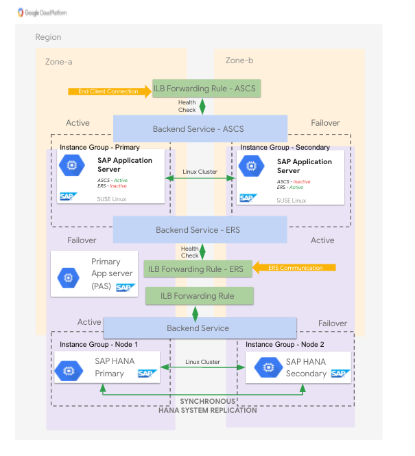

# NetWeaver-HA

This stack builds NetWeaver or S4HANA HA instances, including HANA HA.

# Deployment Architecture



# Requirements

Python 3 is required.

# Usage

See the README at the root of the repository for instructions common to all stacks.

## Deploying the stack

Copy stacks/NetWeaver-HA/vars/deploy-vars.yml and populate it with the variables as described below.

From the root of the repository, run:

```
./ansible-wrapper stacks/NetWeaver-HA/playbook.yml -e @vars.yml
```

## Destroying the stack

Use the same command as for deploying, but add the `state: absent` variable:

```
./ansible-wrapper stacks/NetWeaver-HA/playbook.yml -e @vars.yml -e state=absent
```

# Variables

`sap_ascs_instance_name`: (Required) - Base name of ASCS instance.

`sap_ers_instance_name`: (Required) - Base name of ERS instance.

`sap_hana_install_files_bucket`: (Required) - Bucket where HANA installation files are located.

`sap_hana_instance_name`: (Required) - Base name of HANA instances.

`sap_hana_instance_number`: (Optional, default `00`) - Instance number for HANA. This is a two digit number, but must be in quotes, or it may get converted into single digits, for example `00` without surrounding quotes gets converted to the number `0`.

`sap_hana_instance_type`: (Optional, default `n1-highmem-32`) - The GCE instance type for HANA. Must be one of `n1-highmem-32`, `n1-highmem-64`, `n1-highmem-96`, `n2-highmem-32`, `n2-highmem-48`, `n2-highmem-64`, `n2-highmem-80`, `m1-megamem-96`, `m1-ultramem-40`, `m1-ultramem-80`, `m1-ultramem-160`, `m2-ultramem-208`, or `m2-ultramem-416`.

`sap_hana_password`: (Required) - The password for HANA.

`sap_hana_product_version`: (Optional, default `20SPS03`) - The version of HANA. Must be one of `20SPS03` or `20SPS04`.

`sap_hana_service_account_name`: (Optional, default `sap-common-sa`) - The name of the service account assigned to HANA instances. This should not be a full service account email, just the name before the `@` symbol.

`sap_hana_sid`: (Required) - The System ID for HANA. This is a three character uppercase string which may include digits but must start with a letter.

`sap_hana_virtual_host`: (Required) - The hostname given to the HANA load balancer, added to `/etc/hosts` of instances.

`sap_nw_as_num_instances`: (Optional, default `1`) - Number of application server instances. The first instance will be the PAS, and additional instances will be AAS.

`sap_nw_ascs_instance_number`: (Optional, default `06`) - Instance number for ASCS. This is a two digit number, but must be in quotes, or it may get converted into single digits, for example `00` without surrounding quotes gets converted to the number `0`.

`sap_nw_ascs_virtual_host`: (Required) - The hostname given to the ASCS load balancer, added to `/etc/hosts` of instances.

`sap_nw_ers_instance_number`: (Optional, default `16`) - Instance number for ERS. This is a two digit number, but must be in quotes, or it may get converted into single digits, for example `00` without surrounding quotes gets converted to the number `0`.

`sap_nw_ers_virtual_host`: (Required) - The hostname given to the ERS load balancer (when using Suse) or IP alias (when using RHEL), added to `/etc/hosts` of instances.

`sap_nw_install_files_bucket`: (Required) - Bucket where NetWeaver or S4HANA installation files are located.

`sap_nw_instance_type`: (Optional, default `n1-standard-8`) - The GCE instance type for NetWeaver or S4HANA instances.

`sap_nw_nfs_src`: (Required) - The NFS share for NetWeaver or S4HANA, for example `10.0.0.100:/sap`.

`sap_nw_password`: (Required) - The password for NetWeaver or S4HANA.

`sap_nw_service_account_name`: (Optional, default `sap-common-sa`) - The name of the service account assigned to NetWeaver or S4HANA instances. This should not be a full service account email, just the name before the `@` symbol.

`sap_nw_sid`: (Required) - The System ID for NetWeaver or S4HANA. This is a three character uppercase string which may include digits but must start with a letter.

`sap_pas_instance_name`: (Required) - Base name of application server instances.

`sap_primary_zone`: (Required) - The zone for primary instances, HANA and ASCS and PAS, for example `us-central1-a`.

`sap_project_id`: (Required) - The project ID where instances are located.

`sap_secondary_zone`: (Required) - The zone for primary instances, both HANA and ERS, for example `us-central1-b`.

`sap_source_image_family`: (Required) - The source image family for machines.

`sap_source_image_project`: (Required) - The project for the source image. Official SAP images are from `rhel-sap-cloud` for RedHat or `suse-sap-cloud` for Suse.

`sap_nw_subnetwork`: (Required) - The name of the subnetwork used for machines and load balancers.

`sap_subnetwork_project_id`: (Optional, default `''`) - The name of the subnetwork project, if using a shared VPC. If not given, `sap_project_id` will be used.

`sap_tf_state_bucket`: (Required) - The GCS bucket where Terraform state is stored. If it does not exist, it will be created. Note that the name must be unique, as there can only be one bucket with a given name (it gets a global DNS name). If there is a permissions error when creating this bucket, it is likely that one already exists in another project with the same name.

`sap_tf_state_bucket_prefix`: (Required) - This is the prefix for the Terraform state within the bucket defined in `sap_tf_state_bucket`. This should be unique for each instance of a stack, or there will be conflicts between resources. For example, if creating more than one `NetWeaver-HA` stack, give each one its own `sap_tf_state_bucket_prefix`.

`sap_nw_product`: (Optional, default `NetWeaver`) - The SAP product, must be one of `NetWeaver` or `S4HANA`.

`sap_nw_product_version`: (Optional, default `750`) - The SAP product version. If `sap_nw_product` is `NetWeaver` it must be `750`, if `sap_nw_product` is `S4HANA` it must be `1709` or `1809`.
